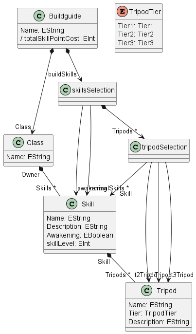
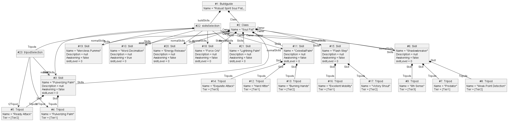

I am modelling website that has guides for the game Lost Ark. Specifically a build guide. To do this we need model different aspects of the game, such as the Classes you can play, the skills that they have, their class engravings, regular engravings, their stats and many more customization options. https://maxroll.gg/lost-ark/build-guides/robust-spirit-soulfist-raid-guide

I have chosen to focus on the skill selection portion of the build guide. 

*I will use player and class interchangably*
A player can have 8 normal skills chosen and 1 awakening skill chosen.
The skills can also be leveled up from 1 to 12 costing skill points to level them up. When a skill is leveled to 4, 7, and 10 they can also have a tripod activated for each level tier. There is between 0-3 tripods per tier per skill. Only one tripod can be activated per tier. 

This could also be extended to handle the different sections that you can see on the website suchs as the Engravings, Gear Sets, Runes. Gems, and Card Sets. As well as further extension with adding other types of guides that cover different parts of the game.

The classes I have are Guides, BuildGuide, Class (such as Warrior, Sorcerer, or Martial Artist), Skill, Tripod, skillSeletion.

A Datatype I am using is an EEnum for the Tripod Tier.

The Attributes and References are obvious from the PlantUML Diagram. 

The Skill Selection Class has a containment reference to skills.

The Skill and Class Classes have references to eachother which are opposites.

I have an OCL constraint on the skill Selection to make sure that the Awakening skill slot is an awakening skill.

I have implemented constraints for the Tripod Selection in Java to make sure that the tripods chosen in a specific tier of the correct tier. And that the tripod's skill matches the tripod selection's skill.

The Java constraint for matching the Tripod Skills with the Tripod Selection.

The Java constraint for matching the Tripod Tiers with the Tripod Selection.

I also have a generated variable for the total skillpoint cost of the build.

A generated variable for the total skillpoint cost of the build: 

A link to the website that I am modelling: https://maxroll.gg/lost-ark/build-guides/robust-spirit-soulfist-raid-guide

A ScreenShot of what I am trying to model

The ECore Model

An Instance of the ECore model modelling a build guide 

